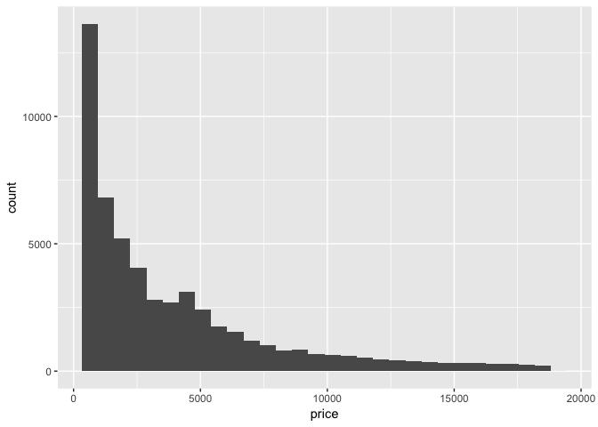

Exploratory Data Analysis (EDA) Solutions
================

The following questions are based on concepts covered in [Chapter 7](https://r4ds.had.co.nz/exploratory-data-analysis.html) of R4DS, and answers to them lie in the `diamonds` dataset of the ggplot2 package. Load the tidyverse, which includes ggplot2, to start working on them.

``` r
library(tidyverse)
```

------------------------------------------------------------------------

**Question 1**: Explore the distribution of `price`. Do you discover anything unusual or surprising? (Hint: Carefully think about the `binwidth` and make sure you try a wide range of values.)

This question is the [second exercise](https://jrnold.github.io/r4ds-exercise-solutions/exploratory-data-analysis.html#exercise-7.3.2) in section [7.3.4](http://r4ds.had.co.nz/exploratory-data-analysis.html#exercises-13) of R4DS. It is designed to strengthen your ability to [visualize the distribution](http://r4ds.had.co.nz/exploratory-data-analysis.html#visualising-distributions) of a continuous variable with the `geom_histogram()` function.

``` r
ggplot(data = diamonds) + 
  geom_histogram(mapping = aes(x = price), binwidth = 100)
```



``` r
# The distribution has a very long tail to the most expensive diamonds. However,
# the majority of diamonds are $1,000 with a small bump below $5,000.
```

------------------------------------------------------------------------

**Question 2**: Which of the 4Cs (carat, cut, clarity, color) is most important for predicting the price of a diamond?

We developed this question based on the second exercise in section [7.5.1](http://r4ds.had.co.nz/exploratory-data-analysis.html#exercises-15) of R4DS. It is designed to strengthen your ability to [interpret variable relationships from plots](http://r4ds.had.co.nz/exploratory-data-analysis.html#covariation).

``` r
# Carat is the clear winner. While there are a number of ways to visualize
# covariation between the 4Cs and price, the plots below suggest that the
# relationship appears to be most dramatic between carat and price.

# The relationship between carat and price can be explored with a scatterplot
# via the geom_point() function
ggplot(diamonds, aes(x = carat, y = price)) +
  geom_point() + 
  geom_smooth()
```


``` r
# The relationship between the categorical Cs (clarity, color, and cut) and
# price can be explored with box plots via the geom_boxplot() function
ggplot(diamonds, aes(x = cut, y = price)) +
  geom_boxplot()
```


``` r
ggplot(diamonds, aes(x = clarity %>% fct_reorder(price), y = price)) +
  geom_boxplot() + 
  coord_cartesian(ylim = c(0, 7500))
```


``` r
ggplot(diamonds, aes(x = color %>% fct_reorder(price), y = price)) +
  geom_boxplot() + 
  coord_cartesian(ylim = c(0, 7500))
```


``` r
# To look at the carat variable as a box plot for consistency purposes, carat
# can be binned using the `cut_width()` function from the ggplot2 package.
diamonds %>%
  ggplot(mapping = aes(x = carat, y = price)) +
  geom_boxplot(mapping = aes(group = cut_width(carat, .25)))
```


------------------------------------------------------------------------

**Question 3**: Plot the distribution of `carat` across various `price` bins using the `geom_boxplot()` and `geom_histogram()` functions. For the latter, leverage the [`facet_wrap()`](http://r4ds.had.co.nz/data-visualisation.html#facets) function.

How would you describe the relationship between `carat` and `price` based on these visualizations?

We developed this question based on the second exercise in section [7.5.3](http://r4ds.had.co.nz/exploratory-data-analysis.html#exercises-17) of R4DS. It is designed to strengthen your ability to [interpret variable relationships from plots](http://r4ds.had.co.nz/exploratory-data-analysis.html#covariation).

``` r
diamonds %>%
  ggplot(mapping = aes(x = price, y = carat)) +
  geom_boxplot(
    mapping = aes(group = price %>% cut_width(width = 2500, center = 1250))
  )
```


``` r
diamonds %>%
  mutate(
    price_binned = price %>% 
      cut_width(width = 2500, center = 1250) %>% 
      fct_relevel(rev)
  ) %>% 
  ggplot(mapping = aes(x = carat)) +
  geom_histogram(binwidth = .125 , center = 0, show.legend = FALSE) +
  facet_wrap(~price_binned, scales = "free_y", ncol = 1)
```


