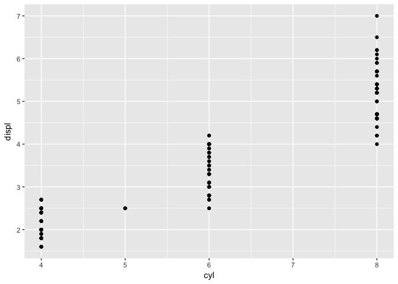
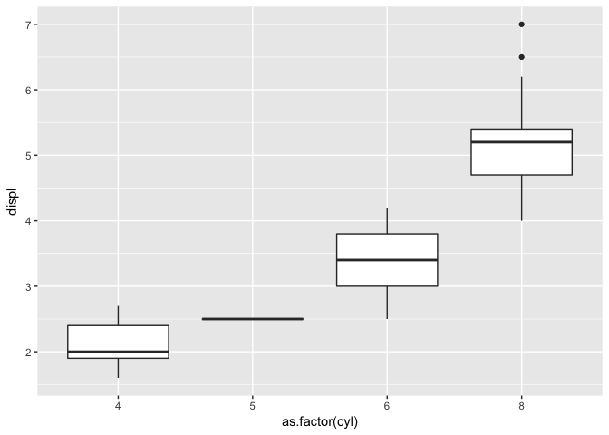
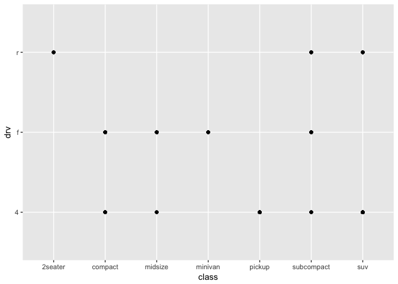
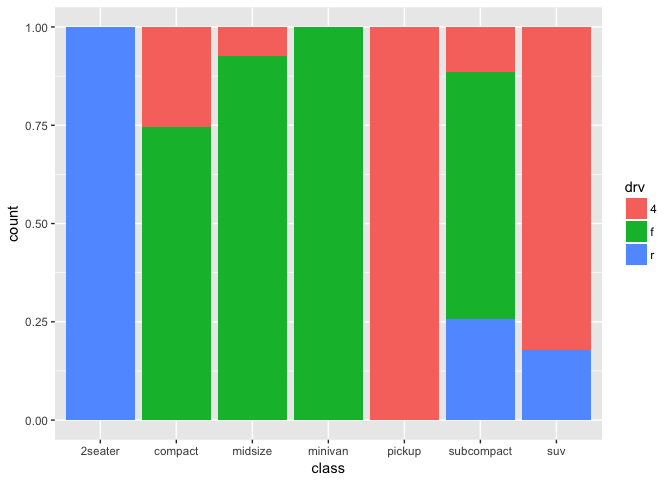

Data Visualization Solutions
================

``` r
# required package
library(tidyverse)
```

------------------------------------------------------------------------

**Question 1**: Run `ggplot(data = mpg)`. What do you see?
*This question is [3.2.4.\#1](http://r4ds.had.co.nz/data-visualisation.html#exercises) and grows your ability to create the ggplot() canvas [(link)](http://r4ds.had.co.nz/data-visualisation.html#creating-a-ggplot).*

**Answer**: An empty graph (i.e., a blank, grey box) in the Plots tab of RStudio. It is a coordinate system that could serve as the canvas of a plot. ggplot() renders the same blank, grey box.

``` r
ggplot(data = mpg)
```


------------------------------------------------------------------------

**Question 2**: Make a scatterplot of `cyl` by `displ`, then make a boxplot to visualize the data. What additional information does the boxplot convey? Hint: Use `as.factor(cyl)` when generating the boxplot.
*This question is based on [3.2.4.\#4](http://r4ds.had.co.nz/data-visualisation.html#exercises) and grows your ability to plot a continuous variable by categorical variable [(link)](http://r4ds.had.co.nz/data-visualisation.html#creating-a-ggplot).*

**Answer**: The scatterplot shows the general trend that cars with more cylinders have higher engine displacement. The boxplots show the median, interquartile ranges, and outlier points. This makes the trend more obvious by showing non-overlapping interquartile ranges and specific medians. The medians roughly show a 1.5 increase in displacement for every 2 cylinders (`cyl` = 4 has `disp` = ~2, `cyl` = 6 has `disp` = ~3.5, `cyl` = 8 has `disp` = ~5).

``` r
ggplot(mpg, aes(cyl, displ)) + 
  geom_point()
```



``` r
ggplot(mpg, aes(as.factor(cyl), displ)) + 
  geom_boxplot()
```



------------------------------------------------------------------------

**Question 3**: What happens if you make a scatterplot of `class` vs `drv`? Create an alternative visualization that better conveys the information. Hint: Use `geom_bar()` with `position="fill"`. Using `geom_bar()` is covered in [3.8](http://r4ds.had.co.nz/data-visualisation.html#position-adjustments).
*This question is based on [3.2.4.\#5](http://r4ds.had.co.nz/data-visualisation.html#exercises) and grows your ability to plot two categorical variables [(link)](http://r4ds.had.co.nz/data-visualisation.html#creating-a-ggplot).*

**Answer**: The scatterplot of `class` vs `drv` plots many observations at the same x,y coordinate so it's difficult to gauge the proportion of observations at each combination. The bar chart more clearly conveys this information.

``` r
ggplot(mpg, aes(x = class, y = drv)) +
  geom_point()
```



``` r
ggplot(mpg) +
  geom_bar(mapping=aes(x=class, fill=drv), position="fill")
```



------------------------------------------------------------------------

**Question 4**: What geom would you use to draw:

-   A line chart?
-   A boxplot?
-   A histogram?
-   An area chart?

Hint: Type `?geom_` and RStudio should autosuggest various geoms\`.
*This question is [3.6.1.\#1](http://r4ds.had.co.nz/data-visualisation.html#exercises-3) and grows your knowledege of various ggplot "geom" objects [(link)](http://r4ds.had.co.nz/data-visualisation.html#geometric-objects).*

**Answer**:

-   `geom_line()`
-   `geom_boxplot()`
-   `geom_histogram()`
-   `geom_area()` or `geom_bar()`

------------------------------------------------------------------------

**Question 5**: Will the graphs created by the two code blocks below look different? Why/why not?

``` r
ggplot(data = mpg, mapping = aes(x = displ, y = hwy)) + 
  geom_point() + 
  geom_smooth()

ggplot() + 
  geom_point(data = mpg, mapping = aes(x = displ, y = hwy)) + 
  geom_smooth(data = mpg, mapping = aes(x = displ, y = hwy))
```

*This question is [3.6.1.\#5](http://r4ds.had.co.nz/data-visualisation.html#exercises-3) and grows your understanding of inheritence with the ggplot mapping argument [(link)](http://r4ds.had.co.nz/data-visualisation.html#a-graphing-template).*

**Answer**: These two code chunks will create the exact same chart. Geometric objects inherit the mapping argument from the `ggplot()` command if specified. In the first code chunk the same mapping is inherited in the same way the mapping is explictly stated in the second code chunk. This example illustrates an important point: Each object can have different mappings which allows for the layering of objects to your visualization.
