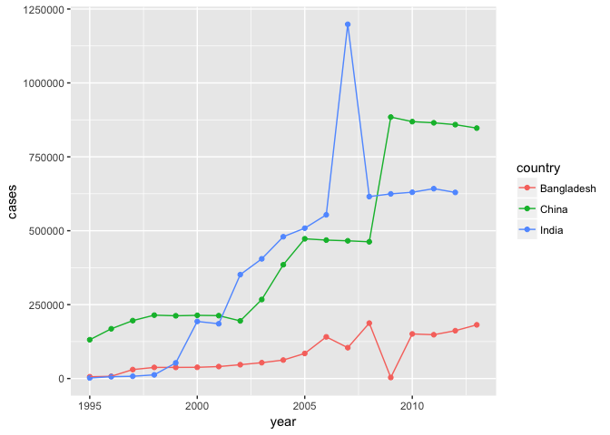
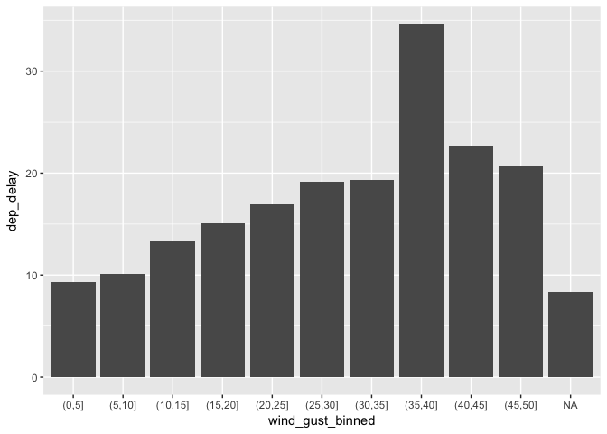

Data Wrangling Solutions
================

``` r
# required packages
library(tidyverse)
library(nycflights13)
```

------------------------------------------------------------------------

**Question 1**: Why does spreading this tibble fail? How could you add a new column to fix the problem? Hint: You can create an indicator column to uniquely identify each observation using the row number like this: `mutate(obs = row_number())`

``` r
people <- tribble(
  ~name,             ~key,    ~value,
  #-----------------|--------|------
  "Phillip Woods",   "age",       45,
  "Phillip Woods",   "height",   186,
  "Phillip Woods",   "age",       50,
  "Jessica Cordero", "age",       37,
  "Jessica Cordero", "height",   156
)

people %>% 
  spread(key, value)
```

    ## Error: Duplicate identifiers for rows (1, 3)

*This question is [12.3.1.\#3](http://r4ds.had.co.nz/tidy-data.html#exercises-22) and grows your understanding of how `spread()` behaves with non-unique rows [(link)](http://r4ds.had.co.nz/tidy-data.html#spreading).*

**Answer**: Spreading the tibble as provided fails because there are two different observations for the age of Phillip Woods. R does not know which observation you would prefer to keep, so it throws an error. The way to fixing this error would be to include an observation indicator to distinguish each observation.

``` r
people <- people %>% 
  group_by(name, key) %>% 
  mutate(obs = row_number())

people %>% 
  spread(key, value)
```

    ## # A tibble: 3 x 4
    ## # Groups:   name [2]
    ##   name              obs   age height
    ## * <chr>           <int> <dbl>  <dbl>
    ## 1 Jessica Cordero     1  37.0    156
    ## 2 Phillip Woods       1  45.0    186
    ## 3 Phillip Woods       2  50.0     NA

------------------------------------------------------------------------

**Question 2**: Do you need to spread or gather the tibble below to tidy it? What are the variables?

``` r
preg <- tribble(
  ~pregnant, ~male, ~female,
  "yes",     NA,    10,
  "no",      20,    12
)
```

*This question is [12.3.1.\#4](http://r4ds.had.co.nz/tidy-data.html#exercises-22) and grows your understanding of what "gathering" a dataset means [(link)](http://r4ds.had.co.nz/tidy-data.html#gathering).*

**Answer**: This dataset should be gathered because there are values represented within the columns. The variables of this dataset should be `pregnant`, `gender`, and `count`.

``` r
preg %>% 
  gather(`male`, `female`, 
         key = "gender", 
         value = "count")
```

    ## # A tibble: 4 x 3
    ##   pregnant gender count
    ##   <chr>    <chr>  <dbl>
    ## 1 yes      male    NA  
    ## 2 no       male    20.0
    ## 3 yes      female  10.0
    ## 4 no       female  12.0

------------------------------------------------------------------------

**Question 3**: Running the following code generates a warning message. What does this message mean? Provide two ways to incorporate all of the data.

``` r
tibble(x = c("a,b,c", "d,e,f,g", "h,i,j")) %>% 
  separate(x, c("one", "two", "three"))
```

    ## Warning: Too many values at 1 locations: 2

    ## # A tibble: 3 x 3
    ##   one   two   three
    ## * <chr> <chr> <chr>
    ## 1 a     b     c    
    ## 2 d     e     f    
    ## 3 h     i     j

*This question is [12.4.3.\#1](http://r4ds.had.co.nz/tidy-data.html#exercises-23) and grows your ability to separate (parse) a column [(link)](http://r4ds.had.co.nz/tidy-data.html#separate).*

**Answer**: The warning message indicates that during parsing there were too many values in observation 2 so it dropped the letter "g" from the third column. To remedy this situation you could make more columns or include the letter "g" within the third column.

``` r
# Method 1: Create more columns
tibble(x = c("a,b,c", "d,e,f,g", "h,i,j")) %>% 
  separate(x, c("one", "two", "three", "four"))
```

    ## Warning: Too few values at 2 locations: 1, 3

    ## # A tibble: 3 x 4
    ##   one   two   three four 
    ## * <chr> <chr> <chr> <chr>
    ## 1 a     b     c     <NA> 
    ## 2 d     e     f     g    
    ## 3 h     i     j     <NA>

``` r
# Method 2: Bring in the extra letter onto the last variable
tibble(x = c("a,b,c", "d,e,f,g", "h,i,j")) %>% 
  separate(x, c("one", "two", "three"), extra='merge')
```

    ## # A tibble: 3 x 3
    ##   one   two   three
    ## * <chr> <chr> <chr>
    ## 1 a     b     c    
    ## 2 d     e     f,g  
    ## 3 h     i     j

------------------------------------------------------------------------

**Question 4**: Both `unite()` and `separate()` have a `remove` argument. What does it do? Why would you set it to FALSE?
*This question is [12.4.3.\#2](http://r4ds.had.co.nz/tidy-data.html#exercises-23) and grows your understanding of how arguments can be used for finer control when parsing a column [(link)](http://r4ds.had.co.nz/tidy-data.html#spreading-and-gathering).*

**Answer**: The `remove` argument determines whether to keep the original column(s) you were using to unite or separate. By default the column(s) is removed; however, you might want to keep it in order to troubleshoot later or use in another operation.

------------------------------------------------------------------------

**Question 5**: Using the `who` dataset, find the total number of cases of TB each year for China, India, and Bangladesh, and plot the data over time. Do you notice anything surprising? Hint: First, run the code block below to generate a cleaned dataset and answer the question using that `clean_who` dataset.

``` r
clean_who <- who %>%
  gather(code, value, new_sp_m014:newrel_f65, na.rm = TRUE) %>% 
  mutate(code = gsub("newrel", "new_rel", code)) %>%
  separate(code, c("new", "var", "sexage")) %>% 
  select(-new, -iso2, -iso3) %>% 
  separate(sexage, c("sex", "age"), sep = 1)
```

*This question is based on [12.6.1.\#4](http://r4ds.had.co.nz/tidy-data.html#exercises-25) and grows your ability to create a full wrangling pipeline and generate results [(link)](http://r4ds.had.co.nz/tidy-data.html#case-study).*

**Answer**: The one surprising conclusion is that the number of TB cases appears stable except for in each country there is a dramatic spike (China & India) or decline (Bangladesh). These could be real anomalies or the result of bad data.

``` r
target_summary <- clean_who %>%
  group_by(country, year) %>%
  summarise(cases = sum(value)) %>%
  filter(country %in% c('China', 'India', 'Bangladesh')) 

ggplot(target_summary, aes(x=year, y=cases, colour=country)) + 
  geom_point() + 
  geom_line()
```



------------------------------------------------------------------------

**Question 6**: What weather conditions make it more likely to see a departure delay? Hint: Your answer should follow these steps:

1.  Join observations existing in both `flights` with `weather` based on `origin`, `year`, `month`, `day`, and `hour`
2.  Bin `wind_gust` and find the average `dep_delay` for different levels of gusts
3.  Create create a plot

*This question is based on [13.4.6.\#4](http://r4ds.had.co.nz/relational-data.html#exercises-28) and grows your ability to use an inner join before summarizing data [(link)](http://r4ds.had.co.nz/relational-data.html#inner-join).*

**Answer**:

``` r
flights %>%
  inner_join(weather, 
             by = c("origin" = "origin",
                    "year" = "year",
                    "month" = "month",
                    "day" = "day",
                    "hour" = "hour")) %>%
  mutate(wind_gust_binned = cut(wind_gust, breaks=seq(0, max(wind_gust,na.rm=T), 5)), 
         precip_binned = cut(precip, breaks=seq(0, max(precip,na.rm=T), .05))) %>%
  group_by(wind_gust_binned) %>%
  summarise(dep_delay = mean(dep_delay, na.rm = TRUE)) %>%
  ggplot(aes(x = wind_gust_binned, y = dep_delay)) +
    geom_col()
```


