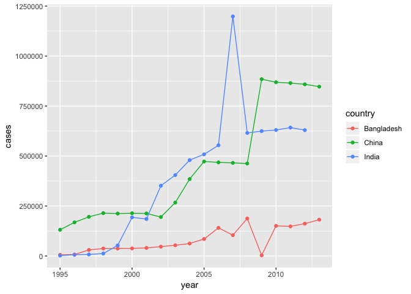

Data Wrangling Solutions
================

The following questions are based on concepts covered in \[Chapter 12\]\[chapter 12\] and \[Chapter 13\]\[chapter 13\] of R4DS, and answers to them lie in the `flights` and `who` datasets of the nycflights13 and ggplot2 package.s Load nycflights13 and tidyverse, which includes ggplot2, to start working on them.

``` r
library(nycflights13)
library(tidyverse)
```

You might also benefit from running `?flights` and `?who` to (re)familiarize yourself with these datasets.

------------------------------------------------------------------------

**Question 1**: The `player` tibble below is meant to record De'Andre Hunter and Kyle Guy's dates of birth and heights. Why can't you tidy it up with the [`spread()`](http://r4ds.had.co.nz/tidy-data.html#spreading) function? How could you add a new column to `player` to fix the problem?

We developed this question based on the third exercise in section [12.3.3](http://r4ds.had.co.nz/tidy-data.html#exercises-22) of R4DS. It is designed to strengthen your understanding of how [`spread()`](http://r4ds.had.co.nz/tidy-data.html#spreading) behaves with non-unique rows.

``` r
player <- tribble(
  ~name,             ~key,     ~value,
  #----------------/---------/-----------------------
  "De'Andre Hunter",    "dob", "December 2, 1997",
  "De'Andre Hunter", "height", 201,
  "De'Andre Hunter",    "dob", "August 11, 1997",
  "Kyle Guy",           "dob", "August 11, 1997",
  "Kyle Guy",        "height", 191
)
```

**Hint:** You can use `group_by()` and `row_number()` to create a `keep` column that identifies unique combinations of keys. This `keep` column can be used to rid the data of the inaccurate observation for De'Andre's date of birth.

``` r
# Spreading the `player` tibble fails because there are two different
# observations for De'Andre's date of birth. R doesn't know which observation
# you'd prefer to keep, so it throws an error (i.e., "Error: Each row of output
# must be identified by a unique combination of keys."). In this instance, you
# can include a `keep` variable to drop the erroneous key-value combination
# where `keep == 2`:

player %>% 
  group_by(name, key) %>% 
  mutate(keep = row_number()) %>% 
  spread(key, value) %>% 
  filter(keep == 1)
```

    ## # A tibble: 2 x 4
    ## # Groups:   name [2]
    ##   name             keep dob              height
    ##   <chr>           <int> <chr>            <chr> 
    ## 1 De'Andre Hunter     1 December 2, 1997 201   
    ## 2 Kyle Guy            1 August 11, 1997  191

------------------------------------------------------------------------

**Question 2**: Do you need to [gather](http://r4ds.had.co.nz/tidy-data.html#gathering) or [spread](http://r4ds.had.co.nz/tidy-data.html#spreading) `preg` (see below) to tidy it? What variables does `preg` include?

``` r
preg <- tribble(
  ~pregnant, ~male, ~female,
  #--------/------/---------
  "yes",        NA,      10,
  "no",         20,      12
)
```

We developed this question based on the fourth exercise in section [12.3.3](http://r4ds.had.co.nz/tidy-data.html#exercises-22) of R4DS. It is designed to strengthen your understanding of the distinction between the [`gather()`](http://r4ds.had.co.nz/tidy-data.html#gathering) and [`spread()`](http://r4ds.had.co.nz/tidy-data.html#spreading) functions of the tidyr package.

``` r
# `preg` needs to be gathered because it has values as variable names. The
# variables in `preg` are `pregnant`, `gender`, and `count`.

preg %>% 
  gather(`male`, `female`, key = "gender", value = "count")
```

    ## # A tibble: 4 x 3
    ##   pregnant gender count
    ##   <chr>    <chr>  <dbl>
    ## 1 yes      male      NA
    ## 2 no       male      20
    ## 3 yes      female    10
    ## 4 no       female    12

------------------------------------------------------------------------

**Question 3**: How would you explain the warning message below in layman's terms to someone who couldn't figure out what it means? Suppose they want to make sure that every piece of the tibble makes its way into the result of the [`separate()`](http://r4ds.had.co.nz/tidy-data.html#separate) function call. What could they do to remedy the situation?

We developed this question based on the first exercise in section [12.4.3](http://r4ds.had.co.nz/tidy-data.html#exercises-23) of R4DS. It is designed to strengthen your ability to parse a column using the [`separate()`](http://r4ds.had.co.nz/tidy-data.html#separate) function of the tidyr package.

``` r
tibble(x = c("a,b,c", "d,e,f,g", "h,i,j")) %>% 
  separate(x, c("one", "two", "three"))
```

    ## Warning: Expected 3 pieces. Additional pieces discarded in 1 rows [2].

    ## # A tibble: 3 x 3
    ##   one   two   three
    ##   <chr> <chr> <chr>
    ## 1 a     b     c    
    ## 2 d     e     f    
    ## 3 h     i     j

``` r
# The warning message indicates that the second observation has an extra piece
# of information (or value), and that this extra piece (i.e., "g") was dropped.
# Setting the `extra` argument to "merge"" rather than "warn", its default,
# remedies this situation.

tibble(x = c("a,b,c", "d,e,f,g", "h,i,j")) %>% 
  separate(x, c("one", "two", "three"), extra = "merge")
```

    ## # A tibble: 3 x 3
    ##   one   two   three
    ##   <chr> <chr> <chr>
    ## 1 a     b     c    
    ## 2 d     e     f,g  
    ## 3 h     i     j

------------------------------------------------------------------------

**Question 4**: Both [`separate()`](http://r4ds.had.co.nz/tidy-data.html#separate) and [`unite()`](http://r4ds.had.co.nz/tidy-data.html#unite) have a `remove` argument. What does it do? When does setting it to `FALSE` make sense?

We developed this question based on the second exercise in section [12.4.3](http://r4ds.had.co.nz/tidy-data.html#exercises-23) of R4DS. It is designed to strengthen your ability to parse columns with functions in the tidyr package while making use of arguments such as `remove`.

``` r
# The `remove` argument determines whether R should remove or keep the original
# column(s) being parsed. The default is to remove the column(s); however, it
# might make sense to keep the original column(s) for troubleshooting purposes
# or another operation in certain situations.
```

------------------------------------------------------------------------

**Question 5**: Using the [`who` dataset](http://r4ds.had.co.nz/tidy-data.html#case-study), calculate the total number of cases of TB per year for China, India, and Bangladesh, then plot these statistics over time. What country-year statistics, if any, surprise you? You can tidy the `who` dataset with:

``` r
who %>%
  gather(code, value, new_sp_m014:newrel_f65, na.rm = TRUE) %>% 
  mutate(code = gsub("newrel", "new_rel", code)) %>%
  separate(code, c("new", "var", "sexage")) %>% 
  select(-new, -iso2, -iso3) %>% 
  separate(sexage, c("sex", "age"), sep = 1)
```

We developed this question based on the fourth exercise in section [12.6.1](http://r4ds.had.co.nz/tidy-data.html#exercises-25) of R4DS. It is designed to strengthen your ability to create a pipeline full of data wrangling and visualization operations.

``` r
who %>%
  gather(code, value, new_sp_m014:newrel_f65, na.rm = TRUE) %>% 
  mutate(code = gsub("newrel", "new_rel", code)) %>%
  separate(code, c("new", "var", "sexage")) %>% 
  select(-new, -iso2, -iso3) %>% 
  separate(sexage, c("sex", "age"), sep = 1) %>%
  group_by(country, year) %>%
  summarise(cases = sum(value)) %>%
  filter(country %in% c('China', 'India', 'Bangladesh')) %>% 
  ggplot(aes(x = year, y = cases, colour = country)) + 
  geom_point() + 
  geom_line()
```



``` r
# The extremely low number of cases in Bangladesh in 2009 might surprise you. It
# is likely an error in the data. For China, the dramatic increase from 2008 to
# 2009 is surprising. For India, 2007 is definitely something worth looking
# into.
```

------------------------------------------------------------------------

**Question 6**: At what wind speeds are departure delays out of NYC the longest on average?

You can begin addressing this question by joining observations in the `flights` dataset of the nycflights13 package with those in `weather` dataset of the same package by `origin`, `year`, `month`, `day`, and `hour`.

We developed this question based on the fourth exercise in section [13.4.6](http://r4ds.had.co.nz/relational-data.html#exercises-28) of R4DS. It is designed to strengthen your ability to merge and analyze relational data with [joins](http://r4ds.had.co.nz/relational-data.html#inner-join) and downstream data transformation operations, such as [group summaries](http://r4ds.had.co.nz/transform.html#grouped-summaries-with-summarise), and [geometric objects](https://r4ds.had.co.nz/data-visualisation.html#geometric-objects).

``` r
flights %>%
  inner_join(weather, by = c("origin", "year", "month", "day", "hour")) %>%
  mutate(
    wind_speed_binned = cut_width(wind_speed, width = 5, center = 2.5)
  ) %>%
  group_by(wind_speed_binned) %>%
  summarize(dep_delay = mean(dep_delay, na.rm = TRUE)) %>%
  ggplot(aes(x = wind_speed_binned, y = dep_delay)) +
  geom_col()
```


``` r
flights %>%
  inner_join(weather, by = c("origin", "year", "month", "day", "hour")) %>%
  ggplot(aes(x = wind_speed, y = dep_delay)) +
  geom_smooth()
```


``` r
# Departure delays are longest when wind speeds are between 30 and 35 mph.
```
