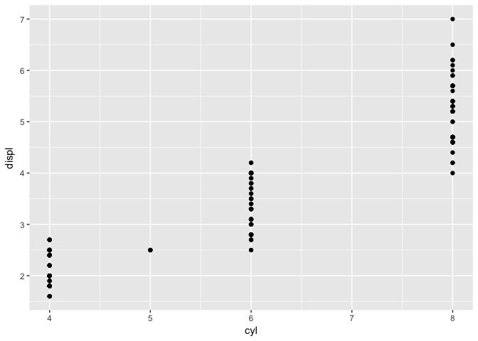
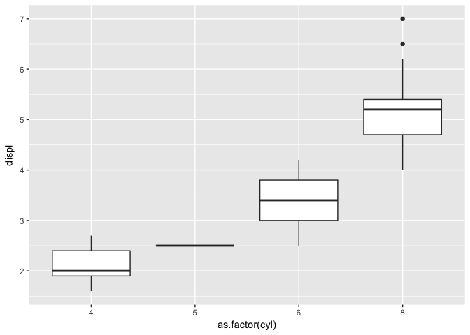
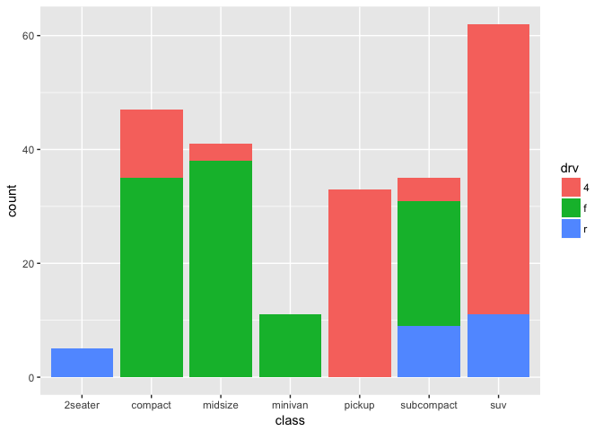

Data Visualization Exercises
================
Zoe Zheng
April 24, 2018

The following 5 questions are based on concepts covered in Chapters 1-3 in R4DS and can be answered using the `mpg` dataset from the `ggplot2` package. Start by loading the `tidyverse` package, which includes `ggplot2`.

``` r
library(tidyverse)
```

It is highly recommended to run `?mpg` from the R console to first familiarize yourself with the dataset.

------------------------------------------------------------------------

**Question 1**: Run `ggplot(data = mpg)`. What do you see?
*This question is [3.2.4.\#1](http://r4ds.had.co.nz/data-visualisation.html#exercises) and grows your ability to create the ggplot() canvas [(link)](http://r4ds.had.co.nz/data-visualisation.html#creating-a-ggplot).*

``` r
ggplot(data = mpg)
```


There is a blank graph.

------------------------------------------------------------------------

**Question 2**: Make a scatterplot of `cyl` by `displ`, then make a boxplot to visualize the data. What additional information does the boxplot convey? Hint: Use `as.factor(cyl)` when generating the boxplot.
*This question is based on [3.2.4.\#4](http://r4ds.had.co.nz/data-visualisation.html#exercises) and grows your ability to plot a continuous variable by categorical variable [(link)](http://r4ds.had.co.nz/data-visualisation.html#creating-a-ggplot).*

``` r
ggplot(mpg, aes(cyl, displ)) + geom_point()
```



``` r
ggplot(mpg, aes(as.factor(cyl), displ)) + geom_boxplot()
```



Both the scatterplot and the boxplot show a positive relationship between cylinders and engine displacement, but the boxplot shows more information than scatterplot. In addition to the positive relationship, the boxplot also shows the medians, interquartile ranges, and outlier points within each engine displacement categories.

------------------------------------------------------------------------

**Question 3**: What happens if you make a scatterplot of `class` vs `drv`? Create an alternative visualization that better conveys the information. Hint: Use `geom_bar()` with `position="fill"`. Using `geom_bar()` is covered in [3.8](http://r4ds.had.co.nz/data-visualisation.html#position-adjustments).
*This question is based on [3.2.4.\#5](http://r4ds.had.co.nz/data-visualisation.html#exercises) and grows your ability to plot two categorical variables [(link)](http://r4ds.had.co.nz/data-visualisation.html#creating-a-ggplot).*

``` r
ggplot(mpg, aes(class, drv)) + geom_point()
```


``` r
ggplot(mpg, aes(x = class, fill = drv), position="fill") + geom_bar()
```



Since class and drv are discrete variables, there are many observations in the same (x, y) coordinate space. Instead, a bar chart shows the count for each record more effectively.

------------------------------------------------------------------------

**Question 4**: What geom would you use to draw:

-   A line chart?
-   A boxplot?
-   A histogram?
-   An area chart?

Hint: Type `?geom_` and RStudio should autosuggest various geoms\`.
*This question is [3.6.1.\#1](http://r4ds.had.co.nz/data-visualisation.html#exercises-3) and grows your knowledege of various ggplot "geom" objects [(link)](http://r4ds.had.co.nz/data-visualisation.html#geometric-objects).*

1 `geom_line()` 2 `geom_boxplot()` 3 `geom_histogram()` 4 `geom_area()`

------------------------------------------------------------------------

**Question 5**: Will the graphs created by the two code blocks below look different? Why/why not?

``` r
ggplot(data = mpg, mapping = aes(x = displ, y = hwy)) + 
  geom_point() + geom_smooth()

ggplot() + 
  geom_point(data = mpg, mapping = aes(x = displ, y = hwy)) + 
  geom_smooth(data = mpg, mapping = aes(x = displ, y = hwy))
```

No. Because if there is no claim in geom\_point and geom\_smooth, these function will use the data and axis that's claimed in ggplot(). So, these two code blocks will generate the same graph.

*This question is [3.6.1.\#5](http://r4ds.had.co.nz/data-visualisation.html#exercises-3) and grows your understanding of inheritence with the ggplot mapping argument [(link)](http://r4ds.had.co.nz/data-visualisation.html#a-graphing-template).*
