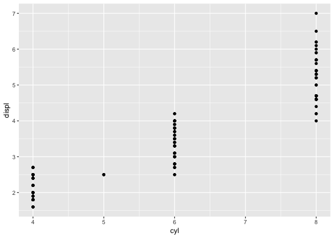
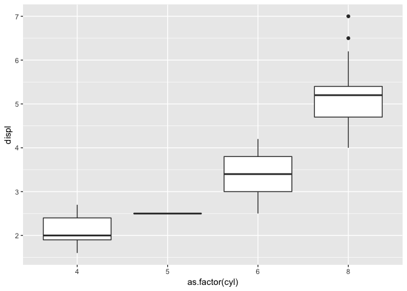

Answers to the R4DS Data Visualization Exercises
================

``` r
library(tidyverse)
```

    ## ── Attaching packages ────────────────────────────────────────────────────────── tidyverse 1.2.1 ──

    ## ✔ ggplot2 3.1.0     ✔ purrr   0.3.0
    ## ✔ tibble  2.1.1     ✔ dplyr   0.7.8
    ## ✔ tidyr   0.8.2     ✔ stringr 1.3.1
    ## ✔ readr   1.3.1     ✔ forcats 0.3.0

    ## ── Conflicts ───────────────────────────────────────────────────────────── tidyverse_conflicts() ──
    ## ✖ dplyr::filter() masks stats::filter()
    ## ✖ dplyr::lag()    masks stats::lag()

**Question 1**: Run ggplot(data = mpg). What do you see?

``` r
ggplot(data = mpg)
```


An empty graph, appearing as a grey box in the Plots tab of RStudio. Think of this graph as a blank canvas that you can use as a foundation for plots. Running `ggplot()` renders the same blank, grey box. **Question 2**: Make a scatterplot of cyl vs displ. Then, make a boxplot with the same variables. What additional information does the boxplot convey?

``` r
ggplot(data = mpg, mapping = aes(x = cyl, y = displ)) +
  geom_point()
```



``` r
ggplot(data = mpg, mapping = aes(x = as.factor(cyl), y = displ)) +
  geom_boxplot()
```



While the scatterplot shows that there is a positive relationship between cylinders and engine displacement, the boxplots display this relationship in greater detail with medians, interquartile ranges, and outlier points. In particular, the medians and non-overlapping interquartile ranges make the relationship quite obvious. The medians roughly show that for every two cylinders, engine displacement increases by 1.5 (i.e., `cyl` == 4 has `disp` = ~2, `cyl` == 6 has `disp` = ~3.5, and `cyl` == 8 has `disp` = ~5).

Question 3: What happens if you make a scatterplot of class vs drv? Why is the plot not useful? Create an alternative visualization that displays the data more effectively.
