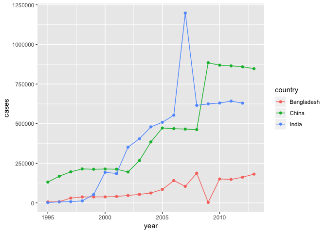
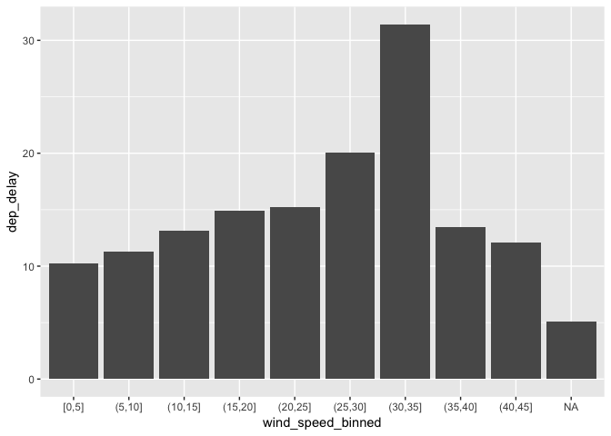
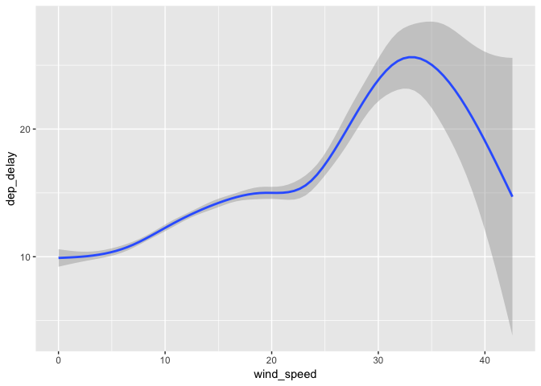

Answer to the Data Wrangling Excercises
================
Brian J. Policard
April 2nd, 2019

``` r
library(nycflights13)
library(tidyverse)
```

    ## ── Attaching packages ──────────────────────────────────────────────────── tidyverse 1.2.1 ──

    ## ✔ ggplot2 3.1.0       ✔ purrr   0.3.2  
    ## ✔ tibble  2.1.1       ✔ dplyr   0.8.0.1
    ## ✔ tidyr   0.8.3       ✔ stringr 1.4.0  
    ## ✔ readr   1.3.1       ✔ forcats 0.4.0

    ## ── Conflicts ─────────────────────────────────────────────────────── tidyverse_conflicts() ──
    ## ✖ dplyr::filter() masks stats::filter()
    ## ✖ dplyr::lag()    masks stats::lag()

**Question 1**: The `player` tibble below is meant to record De'Andre Hunter and Kyle Guy's dates of birth and heights. Why can't you tidy it up with the

``` r
player <- tribble(
  ~name,             ~key,     ~value,
  #----------------/---------/-----------------------
  "De'Andre Hunter",    "dob", "December 2, 1997",
  "De'Andre Hunter", "height", 201,
  "De'Andre Hunter",    "dob", "August 11, 1997",
  "Kyle Guy",           "dob", "August 11, 1997",
  "Kyle Guy",        "height", 191
)
```

There are multiple (different) observations for De'Andre, which produces an error.

``` r
player %>% 
  group_by(name, key) %>% 
  mutate(keep = row_number()) %>% 
  spread(key, value) %>% 
  filter(keep == 1)
```

    ## # A tibble: 2 x 4
    ## # Groups:   name [2]
    ##   name             keep dob              height
    ##   <chr>           <int> <chr>            <chr> 
    ## 1 De'Andre Hunter     1 December 2, 1997 201   
    ## 2 Kyle Guy            1 August 11, 1997  191

**Question 2**: Do you need to \[gather\]\[12.3.1\] or \[spread\]\[12.3.2\] `preg` (see below) to tidy it? What variables does `preg` include?

``` r
preg <- tribble(
  ~pregnant, ~male, ~female,
  #--------/------/---------
  "yes",        NA,      10,
  "no",         20,      12
)
```

Gather is needed since its values are variable names

``` r
preg %>% 
  gather(`male`, `female`, key = "gender", value = "count")
```

    ## # A tibble: 4 x 3
    ##   pregnant gender count
    ##   <chr>    <chr>  <dbl>
    ## 1 yes      male      NA
    ## 2 no       male      20
    ## 3 yes      female    10
    ## 4 no       female    12

**Question 3**: How would you explain the warning message below in layman's terms to someone who couldn't figure out what it means? Suppose they want to make sure that every piece of the tibble makes its way into the result of the \[`separate()`\]\[12.4.1\] function call. What could they do to remedy the situation?

``` r
tibble(x = c("a,b,c", "d,e,f,g", "h,i,j")) %>% 
  separate(x, c("one", "two", "three")) 
```

    ## Warning: Expected 3 pieces. Additional pieces discarded in 1 rows [2].

    ## # A tibble: 3 x 3
    ##   one   two   three
    ##   <chr> <chr> <chr>
    ## 1 a     b     c    
    ## 2 d     e     f    
    ## 3 h     i     j

The warning message means that the 2nd row has an extra value that was "discarded" "merging" the extra value can help solve this warning

``` r
tibble(x = c("a,b,c", "d,e,f,g", "h,i,j")) %>% 
  separate(x, c("one", "two", "three"), extra = "merge")
```

    ## # A tibble: 3 x 3
    ##   one   two   three
    ##   <chr> <chr> <chr>
    ## 1 a     b     c    
    ## 2 d     e     f,g  
    ## 3 h     i     j

**Question 4**: Both \[`separate()`\]\[12.4.1\] and \[`unite()`\]\[12.4.2\] have a `remove` argument. What does it do? When does setting it to `FALSE` make sense? determines if the program should keep or remove the original columns. **Question 5**: Using the \[`who` dataset\]\[12.6\], calculate the total number of cases of TB per year for China, India, and Bangladesh, then plot these statistics over time. What country-year statistics, if any, surprise you?

``` r
who %>%
  gather(code, value, new_sp_m014:newrel_f65, na.rm = TRUE) %>% 
  mutate(code = gsub("newrel", "new_rel", code)) %>%
  separate(code, c("new", "var", "sexage")) %>% 
  select(-new, -iso2, -iso3) %>% 
  separate(sexage, c("sex", "age"), sep = 1) %>%
  group_by(country, year) %>%
  summarise(cases = sum(value)) %>%
  filter(country %in% c('China', 'India', 'Bangladesh')) %>% 
  ggplot(aes(x = year, y = cases, colour = country)) + 
  geom_point() + 
  geom_line()
```



The jump around 2007 is pretty surprising. The increase between 2008 and 2009 is pretty surprising as well **Question 6**: At what wind speeds are departure delays out of NYC the longest average?

``` r
flights %>%
  inner_join(weather, by = c("origin", "year", "month", "day", "hour")) %>%
  mutate(
    wind_speed_binned = cut_width(wind_speed, width = 5, center = 2.5)
  ) %>%
  group_by(wind_speed_binned) %>%
  summarize(dep_delay = mean(dep_delay, na.rm = TRUE)) %>%
  ggplot(aes(x = wind_speed_binned, y = dep_delay)) +
  geom_col()
```

    ## Warning: Factor `wind_speed_binned` contains implicit NA, consider using
    ## `forcats::fct_explicit_na`



``` r
flights %>%
  inner_join(weather, by = c("origin", "year", "month", "day", "hour")) %>%
  ggplot(aes(x = wind_speed, y = dep_delay)) +
  geom_smooth()
```

    ## `geom_smooth()` using method = 'gam' and formula 'y ~ s(x, bs = "cs")'

    ## Warning: Removed 8305 rows containing non-finite values (stat_smooth).



delays tend to increase in lenght with higher wind speeds between 30 and 35 mph
